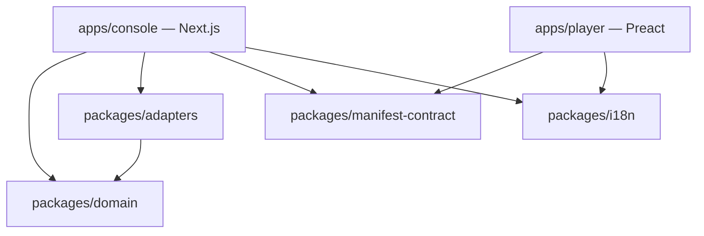
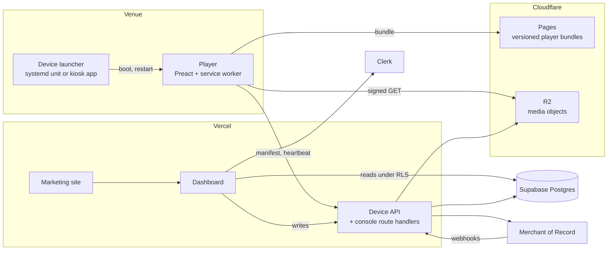
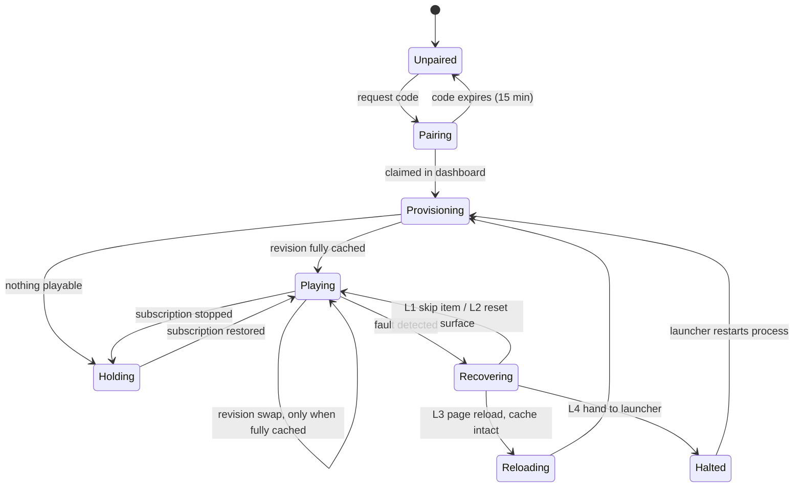
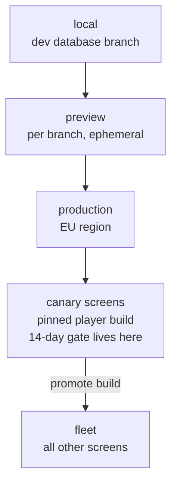
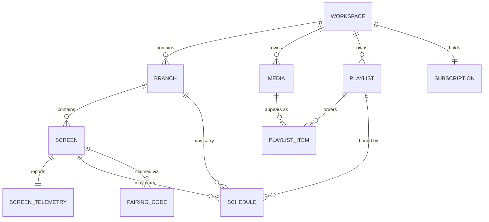

# Architecture Spine — Lawha v1

## Design Paradigm

**Ports and adapters.** Every rented service reaches the product through an adapter behind a port. `packages/domain` imports no vendor SDK — not Supabase, not Clerk, not the Merchant of Record, not R2. This is not architectural taste: four services are rented and at least three are live swap risks (the MoR vendor is unselected; Stripe and Moyasar are both roadmapped behind the same abstraction; Clerk carries a documented RTL risk on the first surface a user meets).

**The player is a supervised state machine over a local cache.** It holds one immutable manifest revision, plays from disk, and escalates through a fixed recovery ladder under supervision of a launcher outside the browser. It reasons about nothing it can get wrong: no schedule precedence, no status derivation, no locale detection.

Layer-to-directory mapping is in [Structural Seed](#structural-seed).

## Invariants & Rules

### Dependency direction



Edges point only downward. No package imports an app; `packages/domain` is a sink with no outgoing edges; `apps/player` may import only `manifest-contract` and `i18n`, never domain, adapters, or any server code.

---

### AD-1 — Rented services sit behind ports

- **Binds:** all
- **Prevents:** vendor SDK types and semantics leaking into domain logic, so that replacing a vendor becomes a rewrite rather than a new adapter.
- **Rule:** `packages/domain` imports no vendor SDK. Clerk, Supabase, the Merchant of Record and R2 are reached only through adapters in `packages/adapters` implementing ports defined in `packages/domain`. The payment port is exactly four verbs — charge, subscribe, cancel, webhook — and is not permitted to grow into a general payments framework.

### AD-2 — The dependency graph is acyclic and downward-only

- **Binds:** all
- **Prevents:** the player acquiring a transitive dependency on server code, and shared packages becoming a second home for app logic.
- **Rule:** as drawn above. A build that introduces an upward or lateral edge fails CI.

### AD-3 — The player never talks to the database

- **Binds:** Group A, Group B, NFR-1 … NFR-7
- **Prevents:** a schema migration darkening screens that cannot be redeployed; a parallel device-credential world inside RLS; uncacheable media delivery.
- **Rule:** the player's entire server surface is three endpoints — `POST /device/register`, `GET /device/manifest`, `POST /device/heartbeat` — plus signed media GETs against object storage. It holds no database client and no Supabase or Clerk credential. The device API is versioned and may not make a breaking change without a version bump.

### AD-4 — Writes are server-mediated; RLS is defence in depth

- **Binds:** all console surfaces
- **Prevents:** rules that are not row predicates — entitlement, schedule resolution, subscription reconciliation — landing in whichever caller remembers to run them.
- **Rule:** the console may read directly through `supabase-js` under RLS keyed on Clerk session claims. Every write and every entitlement-bearing operation goes through a server route handler. RLS stays enabled on every table, but is never the sole enforcement of a rule that cannot be expressed as a row predicate.

### AD-5 — A manifest revision activates only when fully cached

- **Binds:** Group A, Group C, Group D, NFR-4
- **Prevents:** the reachable dark-wall path — playlist updated, player has no bytes, nothing to play — and makes FR-14 (corrupt cache) and FR-11 (current item plays out) consequences rather than special cases.
- **Rule:** the player holds exactly one active manifest revision. A newly fetched revision becomes active only once every asset it references is present in the local cache; until then the previous revision continues to play. Activation happens at an item boundary, never mid-item, unless the currently playing item was itself removed or altered.

### AD-6 — The manifest revision is a server-computed content hash

- **Binds:** Group A, Group D, Group E, Group I
- **Prevents:** the player diffing state it cannot be trusted to diff, and no-op edits redistributing content across a whole branch.
- **Rule:** the revision is a hash of the assembled manifest document, computed server-side on write and stored on the screen record. The player compares one string. A change that produces an identical document produces no new revision and no redistribution.

### AD-7 — The media cache is keyed by content hash, never by URL

- **Binds:** Group C, NFR-12
- **Prevents:** re-signing a URL counting as a cache miss, which would re-download every asset on every rotation and consume the entire 2 GB/screen/month budget — surfacing as an invoice rather than a bug.
- **Rule:** the manifest carries `{hash, url}` per asset. The player looks up its cache by hash and fetches only when the hash is absent. Media URLs are signed GETs with a 7-day TTL, re-issued fresh in every manifest revision — scoped to content change, never to a timer. On a `403` the player re-fetches the manifest rather than failing.

### AD-8 — The manifest names the player build version

- **Binds:** Group A, NFR-1, NFR-2
- **Prevents:** the widest blast radius in the system — an always-latest player means one bad build stops every screen simultaneously, including those running the fourteen-day gate.
- **Rule:** the manifest carries the player build version the screen must run. The service worker fetches that versioned bundle and activates it at an item boundary, never mid-video. Rollback is a database update taking effect within one heartbeat, never a redeploy. Canary screens receive a new build before the fleet.

### AD-9 — Recovery escalates, remembers, and quarantines

- **Binds:** Group A, NFR-1, NFR-2
- **Prevents:** the naive "any fault → reload" design, in which one bad media file becomes an infinite reload loop that the launcher's watchdog never catches because the process looks alive.
- **Rule:** faults escalate through a fixed ladder — (1) skip the failing item, (2) re-initialise the playback surface without a page load, (3) full page reload with the cache intact and never cleared, (4) stop responding and let the launcher restart the process. The fault counter persists in IndexedDB so it survives the reload. An item that fails repeatedly is quarantined locally, skipped, and reported in the heartbeat; **the dashboard must surface that a screen is skipping an item.** Quarantine without that surfacing is the silent divergence FR-18 exists to prevent.

### AD-10 — The player bounds its own memory and storage

- **Binds:** Group A, NFR-6
- **Prevents:** OOM termination during sustained decode on low-memory hardware — a catalogued failure from the prior build attempt.
- **Rule:** at most one item preloaded ahead of the item playing; exactly two media elements ever attached to the DOM, double-buffered for gapless swaps; object URLs revoked when an item is released; `navigator.storage.estimate()` consulted before caching a revision so the player degrades predictably instead of hitting the quota wall.

### AD-11 — Schedule evaluation requires trusted time

- **Binds:** Group E, Group A
- **Prevents:** a device with no real-time clock — every Raspberry Pi and cheap stick — waking after a power cut with no network, believing it is whenever it last was, and confidently serving the wrong content for hours while the dashboard looks healthy the moment the network returns.
- **Rule:** the player takes a server timestamp from every heartbeat response and maintains the offset against a monotonic clock. When the last sync is too old, schedule resolution is low-confidence: the player plays the fallback playlist rather than guessing a window, and reports low confidence in its heartbeat.

### AD-12 — Screen status is a read-time function of `last_seen`

- **Binds:** Group B, NFR-7, NFR-13
- **Prevents:** a stored status drifting from reality. Status cannot lie about a screen if there is no stored status.
- **Rule:** the heartbeat interval is 60 s ± 10 s of jitter. A screen is online if its last heartbeat is within 300 s (5 missed heartbeats, matching NFR-13), computed at query time. No `is_online` column, no counter of consecutive misses, no reconciliation job. Content shown for a screen outside that window is labelled last-known with its timestamp.

### AD-13 — No scheduled background work in v1

- **Binds:** all
- **Prevents:** a second, divergent source of truth appearing behind whatever the request path computes — and an entire class of failure a solo operator cannot watch.
- **Rule:** the system runs no cron, queue, or scheduled job. Derived state is computed at read time or on write. Anything that appears to need a background job is a signal that state is being stored where it should be derived.

### AD-14 — The server resolves schedule precedence; the player holds none

- **Binds:** Group E, Group I, Group A
- **Prevents:** the dashboard and the player disagreeing about what is playing. The player has no opinion to disagree with — a stronger guarantee than a shared rules package, which merely makes two implementations likely to agree.
- **Rule:** because schedules are day-of-week plus time-of-day, a fully resolved schedule is a 168-hour week that repeats. The server collapses all four precedence rules — screen beats branch, narrower beats wider, later beats earlier, fallback last — into a flat weekly timetable of segments carried in the manifest. The dashboard renders that same resolved artifact rather than re-deriving it. Timetables are stored against an IANA timezone identifier and evaluated as local wall time.

### AD-15 — `workspace_id` is the only tenancy key

- **Binds:** all persisted data
- **Prevents:** the specific way FR-57 gets violated — scoping early tables to the Clerk `user_id`, because in v1 one account is one workspace and `user_id` is in the session token. It works until the agency tier, and then it is the live-data migration FR-57 exists to prevent.
- **Rule:** every domain row carries a non-null `workspace_id`, and every RLS policy keys on the workspace claim. Never `user_id`. Never `branch_id` — branch is a grouping inside a workspace, not a boundary; were branch an isolation key, FR-77 (move a screen between branches) would be a data migration instead of an `UPDATE`.

### AD-16 — Screen configuration and screen telemetry are separate records

- **Binds:** Group B, Group I
- **Prevents:** two writers at wildly different rates contending on one row, and blurs the distinction between what an owner configured and what a device reported.
- **Rule:** `screen` holds console-owned configuration — name, branch, assigned playlist, timezone, device tier. `screen_telemetry` holds device-owned observation — last seen, current item, cache state, quarantined items, time confidence — one-to-one. The device API writes exactly one table. This is FR-20's last-known-versus-current distinction expressed in the schema rather than remembered in the UI.

### AD-17 — Entitlement is enforced by the database

- **Binds:** Group B, Group G
- **Prevents:** the check-then-insert race: two players pairing simultaneously both read the same count, both pass, and the owner discovers the over-provision from a customer.
- **Rule:** the entitlement check and the screen insert are one transaction with the count locked, backed by a constraint that makes over-provisioning representable only as an error. Enforcement lives in the database rather than the pairing path, because "the pairing path enforces entitlement" is true the day it is written and false once a second pairing path exists.

### AD-18 — Subscription termination never revokes the device credential

- **Binds:** Group G, Group A
- **Prevents:** making FR-63c impossible. A revoked token turns a stopped screen into unpaired hardware in someone's venue, requiring a physical visit to restore.
- **Rule:** subscription state is a manifest field — `active` / `stopped`. A change bumps the manifest revision; the player keeps its identity, keeps heartbeating, and renders the neutral holding card because the manifest said so. Restoring payment flips the field and the next heartbeat restores playback. Trial branding (FR-79 … FR-82) is another manifest field on the same mechanism.

### AD-19 — Webhooks are idempotent and ordered by event timestamp

- **Binds:** Group G
- **Prevents:** duplicate delivery double-applying state, and out-of-order delivery resurrecting a cancelled subscription.
- **Rule:** store the provider event ID and dedupe on it. Apply by event timestamp, not arrival order; ignore events older than the state already applied. Merchant-of-Record subscription state is the source of truth and is never inferred from local activity.

### AD-20 — The device credential belongs to the screen, not to a user

- **Binds:** Group B, Group A
- **Prevents:** a device being modelled as a user, which would require a Clerk session on hardware that has no human.
- **Rule:** the credential is an opaque long-lived token, hashed at rest, minted at pairing and bound to the screen record. It rotates on re-pair (FR-23) and is revoked on screen removal (FR-22) — and on nothing else. The player bundle is public and carries no secrets; the token lives in device storage, obtained only through pairing.

### AD-21 — Direction is derived once, at the root

- **Binds:** Group F, Group H
- **Prevents:** RTL correctness decaying into a per-component judgement call, which is how a mirrored layout becomes 90% mirrored.
- **Rule:** `dir` is derived from the active locale at the root. No component branches on locale to decide layout — a component asking "are we in Arabic?" is a defect. FR-47's mechanical definition of done is enforced by a CI lint rule that fails the build on physical `left`/`right` layout properties; the machine is the judge, not code review. **This rule and AD-22 bind from the first commit of phase 1**, before any Arabic string exists — that is the PRD's reasoning for placing FR-47's mechanical half, FR-48 and FR-49 in phase 1, and it is the one part of the bilingual layer that cannot be deferred without a rebuild.

### AD-22 — User-visible text is never concatenated

- **Binds:** Group F, Group H
- **Prevents:** bidi correctness (FR-50) becoming a screen-by-screen bug hunt, and text expansion (FR-48) breaking in the places no one thought to test.
- **Rule:** all user-visible strings come from ICU message catalogues with named placeholders. Bidi isolation is applied once at the placeholder boundary, not at call sites. No string concatenation, template interpolation, or sentence assembly in application code.

### AD-23 — The player's language comes from the manifest and its fonts from the app shell

- **Binds:** Group F, Group A
- **Prevents:** a stick shipped with an arbitrary system locale deciding what a venue's wall says; and a player losing its Arabic typeface when the network drops, which fails the Arabic test in exactly the way the product exists to prevent.
- **Rule:** the player takes its locale from the manifest and never from the device or browser. Arabic and Latin display faces are self-hosted, subset, and precached by the service worker as part of the application shell — never as content, never resolved from host fonts.

### AD-24 — Migrations are forward-only and applied by CI

- **Binds:** all persisted data
- **Prevents:** a production schema that no migration history describes, on a database that is the source of truth for screens the builder cannot inspect.
- **Rule:** schema changes are forward-only migrations applied through CI. No manual change against production, ever. Because the player consumes the versioned device API rather than the schema (AD-3), a migration cannot reach a screen directly.

### AD-25 — Manifest assembly is the only path, and every mutation recomputes it

- **Binds:** Group C, Group D, Group E, Group G, Group I
- **Prevents:** two features that both obey every other rule still diverging — a screen moved between branches (FR-77) or a branch schedule edited (FR-74) leaves screens serving a stale timetable, because the feature that made the change did not know it owed a revision recompute.
- **Rule:** one manifest assembler in `packages/domain` builds every manifest. No route, job, or query composes one by hand. Every write that can affect a manifest declares the screens it touches, and the revision is recomputed for exactly those screens inside the same transaction as the write. A write that changes nothing produces no new revision (AD-6).

### AD-26 — A manifest that fails validation is not activated

- **Binds:** Group A
- **Prevents:** a malformed or partially written manifest reaching a device that cannot be redeployed, and turning a server-side mistake into a dark wall.
- **Rule:** `packages/manifest-contract` owns a runtime validator used on both sides — the assembler validates before persisting, and the player validates before activating. A manifest that fails validation is rejected by the player, which keeps its current revision, reports the rejection in its heartbeat, and retries on the next cycle. An invalid manifest can therefore cost freshness but never playback.

### AD-27 — Every server-side data access is explicitly workspace-scoped

- **Binds:** all
- **Prevents:** the cross-tenant leak that AD-4 makes possible. Reads under RLS are scoped by the database; server routes using the service role bypass RLS entirely, so a route that forgets a `where workspace_id = …` returns another company's screens and nothing stops it.
- **Rule:** service-role credentials are confined to a data-access layer whose every function takes a workspace as a required argument. No route handler holds a service-role client directly. The workspace is resolved from the authenticated session — never from a request parameter, a path segment, or a request body.

## Consistency Conventions

| Concern | Convention |
| --- | --- |
| Naming — entities | Domain terms are exactly the PRD glossary: workspace, branch, screen, player, playlist, schedule, fallback playlist, holding card, heartbeat, entitlement. No synonyms in code, tables, or API fields — never `site`, `location`, `device`, `display`, or `tenant`. |
| Naming — actor | One actor, `owner`. Never user, operator, admin, or account. |
| Naming — files & directories | `kebab-case` directories, `kebab-case.ts` modules, `PascalCase` components. |
| Naming — API | Device API paths are `/device/<noun>`; console API routes are resource-shaped and versioned only on the device side. |
| Naming — database | `snake_case` tables and columns, singular table names, `*_id` foreign keys, `created_at` / `updated_at` on every table. |
| Identifiers | UUIDv7 primary keys everywhere, **generated in `packages/domain`, not by a column default** — `uuidv7()` is native only from PostgreSQL 18 and the Supabase platform is on 17. Application-side generation also keeps ID minting vendor-independent (AD-1). Pairing codes are the single exception: six characters, single-use, 15-minute expiry, drawn from an alphabet with no visually ambiguous glyphs. |
| Deletion & referential integrity | A screen is **hard-deleted**; removal releases its entitlement slot immediately (FR-22), and nothing counts toward entitlement except live `screen` rows. Media referenced by a playlist cannot be deleted — the foreign key restricts, and the owner is shown what is using it (FR-28) and must detach first. No soft-delete columns anywhere in v1: a `deleted_at` that entitlement forgets to filter is how an owner pays for screens they removed. |
| Abuse limits | `POST /device/register` is unauthenticated and therefore rate-limited per IP and globally; pairing-code issuance is bounded so code space cannot be exhausted. Heartbeats are rate-limited per device token. |
| Dates & times | UTC `timestamptz` in storage, always. Wall-clock scheduling only ever in a stored IANA timezone identifier. ISO 8601 on the wire. Never a bare offset, never a local timestamp in the database. |
| Text | UTF-8 end to end with no exception in the storage or rendering path. |
| Error shape | Every API error carries a stable machine code and a message key resolved from the ICU catalogue in the owner's language. No bare codes, no stack traces, no generic failure strings reach a person (NFR-9). |
| Money | Minor units as integers, with an explicit currency. Never a float. |
| State mutation | All mutation flows through server route handlers (AD-4). Derived state is computed at read time, never stored and never reconciled by a job (AD-13). |
| Configuration | Environment variables, validated at startup against a schema; the process refuses to boot on a missing or malformed value. No secret ever enters the player bundle (AD-20). |
| Logging & errors | Structured logs with `workspace_id` and, where relevant, `screen_id`. Player error reporting is sampled and rate-limited and piggybacks the heartbeat where it can — an error reporter that retries hard on a flaky connection is a bandwidth leak and a route by which telemetry kills the screen. |
| Auth | Clerk native third-party auth: Supabase verifies Clerk JWTs via JWKS and RLS reads Clerk session claims. The deprecated JWT-template integration is not used. Devices are outside this system entirely (AD-20). |
| Testing | Every NFR-1 … NFR-7 bound is an executable acceptance test against the certified tier. Schedule resolution and entitlement are unit-tested at the domain layer, where they have no vendor dependency. |

## Stack

| Name | Version |
| --- | --- |
| Next.js (`apps/console`) | 16.3 |
| React | 19.2.8 |
| shadcn/ui on Tailwind, over Radix primitives (`apps/console`) | accepted 2026-08-11 |
| Preact (`apps/player`) | 10.29.7 |
| Vite (`apps/player`) | 8.0.9 |
| TypeScript | 6.x — hold |
| PostgreSQL (Supabase managed, EU region) | 17 |
| Supabase | managed platform, Pro |
| Clerk | managed, native Supabase third-party auth |
| Cloudflare R2 | S3-compatible API |
| Cloudflare Pages (`apps/player` hosting) | managed |
| Vercel (`apps/console` hosting) | managed |
| Merchant of Record | vendor unselected — see Deferred |
| Player browser baseline | Chromium 76 / ES2019 |

TypeScript 7.0 reached GA on 8 July 2026 with a native Go compiler, but ships without a stable programmatic API, so `typescript-eslint` and comparable tooling cannot yet follow. Hold on 6.x and revisit when the lint toolchain supports 7.

**The console UI layer was a UX-originated claim and is now accepted (2026-08-11).** This spine originally named no UI library and no token system, while EXPERIENCE.md and DESIGN.md were written against shadcn/ui on Tailwind with Radix underneath. Radix is load-bearing rather than convenient: it supplies the RTL behaviour and the keyboard and focus floor that FR-47 and the accessibility target depend on, so rejecting it would have converted every accessibility-floor item in those spines into hand-built work. It binds `apps/console` only — `apps/player` shares the token layer and nothing else, which is what keeps the Chromium 76 floor enforceable.

**Flash safety on owner-uploaded video is answered in the client (2026-08-11).** WCAG 2.3.1 is a Level A obligation with a physical-harm dimension on a public wall, and the uploader already enforces size and format ceilings client-side before transfer, so the flash check extends an existing stage rather than adding one. This deliberately keeps the *no transcoding, no ingest pipeline* position below intact. The residual is recorded rather than hidden: browser-side frame sampling is heuristic, so a confident breach is refused, an uncertain result becomes a warning the owner acknowledges, and full conformance would require server-side analysis on ingest — the revisit condition for the pipeline decision.

The player baseline is Chromium 76 because Samsung's own specifications put Tizen 6.0 (2021 televisions) at Chromium M76 — the realistic floor of sets in the wild. A consequence: **Screen Wake Lock arrived in Chrome 84 and therefore does not exist on Tizen 6.0 or older.** NFR-15's verification is thereby answered in advance for that tier, and best-effort devices need the muted-looping-video fallback rather than the API.

## Structural Seed

### System containers



### Player state machine



Offline is not a state. The player plays from cache in every state above; connectivity affects only whether a new revision can be fetched.

### Deployment and environments



Personal data — Supabase and Clerk both — is held in EU/UK regions under GDPR, with a data-processing agreement per subprocessor. Saudi PDPL is parked and becomes live only on Gulf entry. Database backups are Supabase point-in-time recovery; media in R2 is the customer's own uploaded content and is not separately backed up in v1.

The certified tier's launcher is outside this system and is not built here: a `systemd` unit running Chromium in kiosk mode on Raspberry Pi, and on Android a kiosk browser application — Fully Kiosk Browser (paid, per device) and FreeKiosk (free, open source, device-owner support) are both current options providing boot-start and crash-restart. Which one is a setup-documentation decision, not an architectural one; AD-3 and AD-8 are what keep it swappable.

### Core entities



Every entity above carries `workspace_id` (AD-15). A default branch exists in every workspace and is used implicitly, so a single-location owner never meets the concept (FR-71).

### Source tree

```text
lawha/
  apps/
    console/            # Next.js — marketing site + dashboard + all server routes
    player/             # Preact + Vite — static bundle, service worker, no SSR
  packages/
    domain/             # entities, ports, schedule resolution, entitlement rules; no vendor imports
    adapters/           # Clerk, Supabase, R2, Merchant-of-Record adapters implementing domain ports
    manifest-contract/  # the manifest schema and its types — the console/player contract
    i18n/               # ICU message catalogues, locale + direction resolution
  supabase/
    migrations/         # forward-only, applied by CI
```

## Capability → Architecture Map

| Capability / Area | Lives in | Governed by |
| --- | --- | --- |
| A — Player runtime, offline, recovery | `apps/player` | AD-3, AD-5, AD-8, AD-9, AD-10, AD-11, AD-23, AD-26 |
| B — Pairing, screens, honest status | `apps/console` device API + `screen` / `screen_telemetry` | AD-12, AD-16, AD-17, AD-20 |
| C — Media upload, library, delivery | `apps/console` routes + R2 | AD-4, AD-7, AD-25, no-pipeline rule |
| D — Playlists | `packages/domain` + manifest assembler | AD-5, AD-6, AD-25 |
| E — Scheduling and precedence | `packages/domain` (resolution) → manifest | AD-11, AD-14, AD-25 |
| F — Bilingual layer | `packages/i18n` + both apps | AD-21, AD-22, AD-23 |
| G — Account, billing, entitlement | `apps/console` routes + `packages/adapters` | AD-1, AD-17, AD-18, AD-19, AD-25 |
| H — Public website and documentation | `apps/console` public routes | AD-21, AD-22 |
| I — Branches and multi-location | `packages/domain` + schema | AD-14, AD-15, AD-16, AD-25 |
| Workspace isolation | RLS + explicit server-side scoping | AD-4, AD-15, AD-27 |
| Operational envelope | CI, Vercel, Cloudflare, Supabase | AD-8, AD-13, AD-24 |

## Deferred

**Owned by the product owner, not by architecture.**

- **Merchant-of-Record vendor.** Unselected. Saudi Arabia payout support must be verified with the specific provider before committing. The four-verb port (AD-1) means the choice does not block build order — but it does block shipping phase 2.
- ~~**Pricing, and the storage allowance per screen.**~~ **RESOLVED 2026-08-11: $5 per screen per month, 10 GB storage per screen pooled across the workspace.** The storage figure is derived independently — R2 cost is roughly 15 cents per screen per month at this allowance, trivial against the price — since the comparable product publishes no storage figure to match.
- **Reason-to-buy and the product promise.** Blocks website copy and pricing. Does not touch this spine.

**Owned by architecture, with a revisit condition.**

- ~~**Clerk Arabic and RTL.**~~ **RESOLVED 2026-08-11 by product-owner direction:** neither option is taken. The authentication surface renders in **English in both locales** — not translated, not mirrored, not replaced — so the CSS-override cost is not paid and the headless-component move is not made. **Clerk survives as the auth adapter.** FR-53 was revised in the PRD to match, and FR-45 carries a single narrow carve-out for this surface. AD-21 is unaffected: the exception is an embedded third-party surface, not a component of ours branching on locale, so the root-derived direction rule stands unchanged. Revisit if Arabic-speaking markets become the sales motion, where this stops being a cost saving and becomes the first impression.
- **Wake-lock fallback on best-effort devices.** The muted-looping-video technique is the intended answer for engines below Chromium 84, but it is unverified on Tizen and webOS specifically. Revisit when a best-effort device first enters testing.
- **TypeScript 7.** Revisit when `typescript-eslint` supports the native compiler.

**Deliberately not decided at this altitude.**

- **Push transport.** HTTP heartbeat only in v1. Revisit if 60-second content latency becomes a real complaint rather than an imagined one — a websocket layer can be added behind the same manifest-revision semantics without changing any AD here.
- **Transcoding.** None in v1; FR-26 guarantees only MP4/H.264 and the quarantine ladder catches what slips through. Revisit when rejected-upload support load justifies a pipeline.
- **Proof-of-play, analytics, and any append-only telemetry history.** Out of v1 scope, which is why AD-12's single-row telemetry update is sufficient. Adding them means adding the first table this spine does not have.
- **Roles and permissions; agency workspaces.** Out of v1. AD-15 is what keeps them cheap later.
- **Native Android shell.** Recorded in the PRD as a live alternative to the third-party kiosk browser. AD-3 and AD-8 mean it would be a second player implementation against an unchanged device API — the reason to keep that contract narrow.
- **Multi-region deployment.** Single EU region in v1 (NFR-10). Revisit before any market with its own residency law.

## Divergence from source

**FR-43 (Hijri calendar display) is dropped**, by product-owner direction during this run. It was presentation-only under AD-14 — the scheduling semantics are day-of-week and never touch a calendar system — so removal costs nothing structurally and it can return later at the same cost. FR-44, the configurable working week, is retained.

The PRD was amended on 2026-08-11 to match: the FR-43 row is replaced by a withdrawal note under Group E, Hijri calendar display is listed in § 4.2 as out of v1, and the addendum's RTL engineering note is corrected. The ID is retired, not reused. The two documents agree.

**FR-53 was revised 2026-08-11**, by product-owner direction during the frontend spec run: the hosted authentication surface stays English in both locales. This closes the `Deferred` item above and is recorded here because it is the one place where a rented service's limitation was accepted rather than engineered around — the posture everywhere else in this spine is that a vendor's shortcoming is absorbed by an adapter, and here it is absorbed by the user instead. Checkout is unchanged and still owes Arabic and mirroring.

**FR-81's mirroring is resolved by flow and alignment, confirmed 2026-08-11.** `inset-inline-*` shipped in Chrome 87 and does not exist at the Chromium 76 floor, so the trial badge mirrors through grid alignment — direction-aware since Chrome 57 — rather than being positioned into a corner. FR-47 is satisfied literally, with no physical property anywhere and no `dir`-scoped exemption needed. The fallback that was held in reserve, scoping FR-47's mechanical rule to the console, is not taken.

**A fourth instance of the same bug class was caught during UX validation and binds here:** the logical border *shorthands* — `border-inline-start`, `border-block-end` — shipped in the same Chrome 87 batch as the logical insets and are therefore also unavailable at the player floor. Player and shared code use the longhand forms. The rule generalises: a logical property is not automatically available at the floor merely because logical properties in general are.

**AD-12's offline window is reconciled to NFR-13, confirmed 2026-08-12.** The test-design system-level review (`bmad-testarch-test-design`) caught a numeric conflict: AD-12 originally set the online window at 180 s (3 missed heartbeats) while NFR-13 (PRD) specifies offline after 5 consecutive missed heartbeats (~300 s). Both independently satisfied NFR-7's "within roughly five minutes" bound, but left two candidate thresholds for the same acceptance test. AD-12 is corrected to 300 s / 5 missed heartbeats to match NFR-13 exactly. No other rule depending on AD-12 changes — this widens the online window, it does not narrow it.
