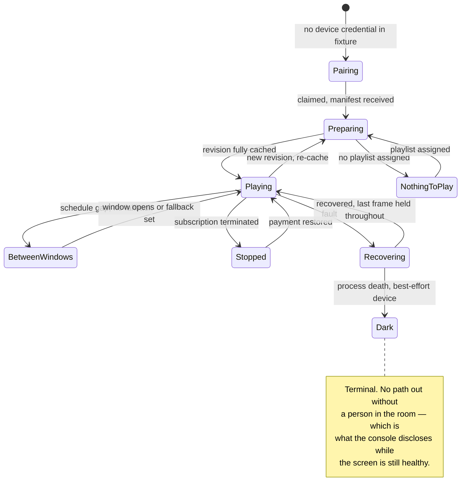

# Surface Inventory — Lawha v1 Frontend

Every user-facing surface in scope, its states, and the requirements it carries. This is the traceability spine: downstream never needs to open the PRD, because every frontend-load-bearing FR lands in a row below.

Read alongside [SPEC.md](SPEC.md). Behaviour is specified in EXPERIENCE.md and appearance in DESIGN.md; this file says *what exists* and *what states each thing must ship*. Where EXPERIENCE.md carries a per-surface state matrix, it is the authority and this file points at it rather than restating it.

**State vocabulary.** Every surface ships `empty`, `loading`, `partial`, `error`. Where applicable it also ships `stale`, `at-limit`, and `stopped`. **Every console surface additionally ships `console-offline`.** A surface missing a state it should carry is not done.

---

## Console — `apps/console`

| Surface | Reached from | Carries | Extra states | Requirements |
|---|---|---|---|---|
| **Screens** | Sign-in landing, nav | Every screen grouped by branch; name, current playlist, last-confirmed time, status tag; global alarm banner | stale, stopped, at-limit | FR-17, FR-18, FR-19, FR-20, FR-6a, FR-72, FR-76 |
| **Screen detail** | Screens row | Rename, reassign playlist, per-screen schedule, timezone, device tier, re-pair, remove | stale, stopped | FR-21, FR-22, FR-23, FR-42, FR-6a |
| **Pair a screen** | "Add a screen" from Screens or its empty state | Six-character code entry; the only path a screen enters the workspace | at-limit | FR-16, FR-59 |
| **Media** | Nav | Library with thumbnail, name, size, upload date; uploader; storage meter against a **10 GB per screen, pooled** allowance | at-limit | FR-24, FR-25, FR-26, FR-27, FR-28, FR-29 |
| **Playlists** | Nav | Playlist list with item count and where each is assigned | — | FR-31, FR-35 |
| **Playlist editor** | Playlists row, or created from Media | Ordered items, per-item durations, screen assignment, per-screen propagation status, the FR-11 play-out delay | — | FR-11, FR-32, FR-33, FR-34, FR-35, FR-36, FR-37 |
| **Schedules** | Nav, or from a screen / branch | Windows bound to playlists, fallback selection, and the **resolved** outcome for any given time | — | FR-38, FR-39, FR-40, FR-41, FR-42, FR-44 |
| **Branches** | Nav | Locations, per-branch health summary, branch timezone, bulk playlist assignment, move a screen | — | FR-70 – FR-78 |
| **Billing** | Nav | Plan, screen entitlement, invoices, receipts, cancel; payment-failure banner | at-limit, stopped | FR-58, FR-59, FR-62, FR-63a, FR-63c |
| **Settings** | Nav | Interface language, workspace timezone, account | — | FR-45, FR-46, FR-54 |
| **Sign up / sign in** | Website, or unauthenticated entry | Hosted third-party surface — **handoff boundary only, English in both locales** | — | FR-56; **overrides FR-53** |

Two surfaces are reached only from within a flow and never from navigation — **Pair a screen** and **Playlist editor**. Both are tasks, not places, and navigation must not list them.

**`console-offline` binds all eleven.** A persistent notice stating that the browser cannot reach the server, so every status is as of the last successful fetch, with that time named. A dashboard still showing *Live* while unable to refresh is the claim the truth contract forbids.

### Cross-console requirements

| Requirement | What it means here |
|---|---|
| FR-45 | No screen, error, empty state, notice, or email falls back to the other language. A missing catalogue key is a build failure. **One carved-out exception, by direction: the hosted authentication surface.** It does not widen — no surface Lawha builds may claim it. |
| FR-46 | Language persists per user across sessions and devices. `Accept-Language` is consulted on a first visit and never after. |
| FR-47 | Full mirroring: navigation origin, directional icons, stepper and progress direction, form and label alignment, table column order, drawer and menu origin. Non-directional icons do not mirror. |
| FR-48 | No text container has a fixed height or width; `min-block-size`, never `block-size`. |
| FR-49 | UTF-8 end to end, no exception. |
| FR-50 | Mixed Arabic/Latin runs render per the Unicode Bidirectional Algorithm, isolated **as markup** and never as Unicode control characters. |
| FR-54 | Dates, times, and numerals formatted per the active locale; numerals stay Latin digits, LTR, bidi-isolated. |
| FR-55 | Navigation tolerates label expansion. No horizontal tab row anywhere in the product. |
| NFR-8 | The setup path completes in under fifteen minutes unaided — the fixture walkthrough is where this is first rehearsable. |
| NFR-9 | Every message names the condition and the next action. No bare code, stack trace, or generic failure string. |

---

## Player display — `apps/player`

Eight states, no navigation, no input. Fixed 16:9 landscape at a 1920×1080 design target, type in the `vmin` player tiers, viewing distance 2–4 metres. The UX states refine the architecture spine's state machine: its single `Holding` becomes three register-bearing states, because who is looking at the wall changes what may appear on it.

| State | Architecture state | Register | Trigger | Requirements |
|---|---|---|---|---|
| **Pairing** | `Unpaired` / `Pairing` | Owner | Unpaired, or code expired and regenerated | FR-1, FR-2, FR-15, FR-16 |
| **Preparing** | `Provisioning` | Owner *(customer on re-cache)* | Manifest received, revision not yet fully cached | AD-5, FR-14 |
| **Playing** | `Playing` | — | Revision cached, window active or fallback assigned | FR-3, FR-36, FR-37 |
| **Nothing to play** | `Holding` | Owner | Paired, no playlist assigned | FR-12 |
| **Between windows** | `Holding` | Customer | Schedule gap with no fallback | FR-40, FR-12 |
| **Subscription stopped** | `Holding` | Customer | Termination confirmed | FR-63, FR-63b |
| **Recovering** | `Recovering` / `Reloading` | Invisible | Recovery ladder engaged | FR-12, FR-6 *(display half)* |
| **Dark** | `Halted` | None | Process death on a best-effort device — unrecoverable | PRD §4.3 |

**Preparing is the state nobody plans for.** A revision activates only when fully cached, so there is a real, sometimes minutes-long window between paired and playing — Flow 1 between steps 6 and 7, with Yusuf standing in front of the TV. Owner register on a first cache, saying what it is doing. On a mid-life re-cache the venue's customers are watching, so the register switches and the last playing frame is held instead.

**Recovering holds the last frame.** An L3 page reload is a visible flash on a 1920×1080 wall and a return through Preparing, so the player holds what was rendered rather than flashing to white.

**Dark is the boundary on "never fails visibly."** The absolute holds only while the player is running; on a best-effort device, process death leaves the wall dark until someone intervenes. That is precisely what the `No auto-restart` tag discloses in the console, before it happens.

**Trial badge** overlays Playing during a trial: label tier at reduced opacity, ≤2% of screen area, wholly inside the outer 10% margin of one corner, mirrored by flow, never animated, removed within one heartbeat cycle of payment confirmation. FR-79 – FR-82.

**The player never detects its locale.** Language, direction, and the reduced-motion flag all arrive in the manifest fixture — a Tizen TV's audience of passers-by can set no preference, so the manifest is the only reachable channel. FR-51 and FR-52 bind in their presentation half: Arabic and Latin display faces are self-hosted and subset as part of the application shell, never resolved from host fonts.

### Player display states

Offline is not a state here, and that is deliberate: the player plays from cache in every state above. In a fixture build connectivity is not modelled — what *is* modelled is that no transition is ever triggered by the player noticing something about itself.

---

## Public site and documentation — routes in `apps/console`

**Built last, by product-owner direction.** The UX run scoped Group H out deliberately, so these two surfaces have visual tokens but no behavioural spine. Rather than closing that gap now, it is deferred: a `bmad-ux` pass scoped to Group H runs once the rest of the product exists to describe, then these surfaces are built against it. The rows below are the requirements' own content and nothing more.

| Surface | Carries | Requirements |
|---|---|---|
| **Marketing site** | What the product is, and **$5 per screen per month** on the page — no sales call, no quote request, no gated tier. Copy is written against the placeholder promise, *"The screen is never wrong, and they never call anyone"*; the distinguishing claim is still undefined | FR-64, FR-66, FR-67 |
| **Setup documentation** | Pairing a screen, uploading media, building a playlist, scheduling, and the certified-versus-best-effort distinction. Publicly readable without an account. **The surface is built here; its words are authored afterwards** | FR-68 |
| **Both** | Complete in English and Arabic with full mirroring, held to the Group F standard. Language selection persists between site and console | FR-65, FR-69 |

---

## The truth contract, as rendering rules

Four rules, restated as things a component either does or does not do. No surface may violate them for a cleaner layout.

1. **Status is heartbeat recency and nothing else.** In a fixture build there are no heartbeats, so status is a fixture field — and it is still never inferred, never optimistic.
2. **An unconfirmed screen shows an absolute last-confirmed time.** Never "a while ago."
3. **Content shown for an unconfirmed screen is labelled last-known.** *"Lunch Menu — last confirmed at 09:14"*. The label is part of the value, not a tooltip on it.
4. **Device tier is disclosed on the screen it applies to, while that screen is healthy** — because that is when the owner can still act on it.

**Calm until it matters, but never silent to a screen reader.** A healthy screen carries no colour, no dot, no checkmark; its accessible name still asserts *"Live, confirmed just now"*. Without that, *loading*, *healthy*, and *partial* collapse into one silence — fatal on a product whose thesis is that silence means verified-healthy. Escalation is a global non-dismissible banner plus a row promoted into the structural border tier carrying a complete sentence, in place, never a tooltip or a modal.

---

## Requirements deliberately not carried here

Present in the PRD, out of this spec's scope, listed so their absence reads as a decision.

- **FR-4, FR-5, FR-7, FR-8, FR-9, FR-10, FR-13** — player runtime behaviour: offline continuity, resync, wake lock, relaunch, heartbeat emission, memory bounds, local schedule evaluation. This spec builds what the player shows, not what keeps it alive.
- **FR-6** — only its display half is here. The recovery ladder itself is runtime.
- **FR-30** — cacheable media URLs. Delivery, not presentation.
- **FR-57, FR-60, FR-61, FR-63** — workspace record, webhook reconciliation, payment provider abstraction, termination trigger. Backend.
- **NFR-1 … NFR-7, NFR-10 … NFR-15** — reliability, residency, bandwidth, heartbeat timing, device matrix. None is a presentation concern. NFR-8 and NFR-9 are carried above.
- **FR-43** — withdrawn upstream on 2026-08-11. ID retired, not reused.
